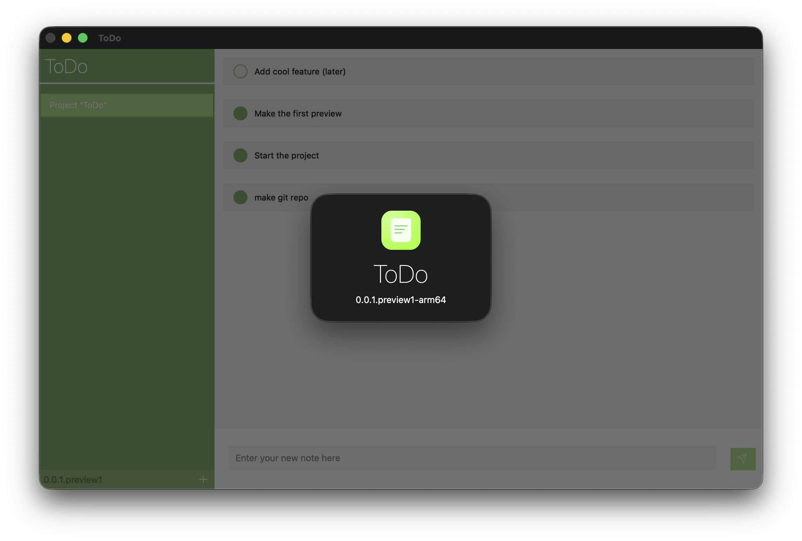

# ToDo

Small **C++/Qt** (Widgets) task list application with local **SQLite** persistence.



## Features

- Create, rename, and delete lists.
- Create, edit, and delete notes/tasks.
- Mark tasks as completed.
- Automatic local save in a SQLite database.

## Requirements

- Qt (`widgets` and `sql` modules)
- `qmake`
- A C++17 compiler

## Quick Build

From the project root:

```bash
qmake ToDo.pro
make
```

## Run the Application

```bash
./ToDo
```

## Data

Data is stored in a `todo.sqlite3` SQLite file, created in the app data directory (`QStandardPaths::AppDataLocation`).

## Project Structure

- `src/gui`: user interface (windows, dialogs).
- `src/core`: business services (`ListService`, `NoteService`).
- `src/obj`: domain objects (`List`, `Note`).
